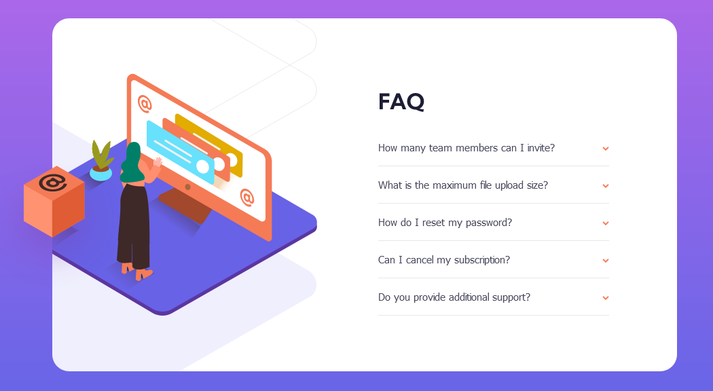

# Frontend Mentor - FAQ accordion card solution

This is a solution to the [FAQ accordion card challenge on Frontend Mentor](https://www.frontendmentor.io/challenges/faq-accordion-card-XlyjD0Oam).

## Table of contents

- [Overview](#overview)
  - [The challenge](#the-challenge)
  - [Screenshot](#screenshot)
  - [Links](#links)
- [My process](#my-process)
  - [Built with](#built-with)
  - [What I learned](#what-i-learned)
  - [Continued development](#continued-development)
  - [Useful resources](#useful-resources)
- [Author](#author)
- [Acknowledgments](#acknowledgments)

## Overview

### The challenge

Users should be able to:

- View the optimal layout for the component depending on their device's screen size
- See hover states for all interactive elements on the page
- Hide/Show the answer to a question when the question is clicked

### Screenshot



### Links

- Live Site URL: [https://lucasepk.github.io/faq-accordion-card/](https://lucasepk.github.io/faq-accordion-card/)

## My process

### Built with

- HTML
- CSS
- JavaScript
- Flexbox

### What I learned

In this project I learnt that google fonts has different weights and you have to copy paste the HTML code like the one below:

```html
  <link rel="preconnect" href="https://fonts.googleapis.com">
  <link rel="preconnect" href="https://fonts.gstatic.com" crossorigin>
  <link href="https://fonts.googleapis.com/css2?family=Kumbh+Sans:wght@400;700&display=swap" rel="stylesheet">
```

The major thing I learnt about css in this project is that negative margin is a thing and the :after thing. Then i learnt some background image manipulation stuff, like background-position, background-color: transparent and background-size.

```css
#girl_screen img{/*this is the box and the margin is negative so it goes outside*/
    margin: 95px 0 0 -93px;
}

.question_txt:after{ /*after inserts something after the content of the selected element*/
    content: url(images/icon-arrow-down.svg);
    float: right;
    margin-left: 5px;
}

.active:after{
    /*flips arrow and makes it upside down after being pressed*/
    -webkit-transform: scaleY(-1);
    transform: scaleY(-1);
}
```

The major thing about this project is that I learnt how to do accordion buttons.
```js
//this shows the text that is hidden otherwise, in an accordion fashion
let questions = document.getElementsByClassName("question_txt");
let i;

for(i=0; i<questions.length; i++){
    questions[i].addEventListener("click", function(){
      /* Toggle between adding and removing the "active" class, to highlight the button that controls the answer */
      this.classList.toggle("active");

      /* Toggle between hiding and showing the active answer */
      let answer = this.nextElementSibling; //nextElementSibling takes the next element in the HTML
      let other_answer;
      if (answer.style.display === "block") {//hides answer if clicked
        answer.style.display ="none";
      } else { //shows answer if clicked but closes the other answers that are opened
        answer.style.display = "block";

        //closes all the other answers
        for(j=0; j<questions.length; j++){
          other_answer = questions[j].nextElementSibling;
          if(this != questions[j] && other_answer.style.display === "block"){
            questions[j].classList.toggle("active");
            other_answer.style.display = "none";
          }
        }
      }
    });
}
```

### Continued development

I want to understand more what ":after" in css does and probably learn CSS grid to have another tool.

### Useful resources

- [https://www.w3schools.com/howto/howto_js_accordion.asp](https://www.w3schools.com/howto/howto_js_accordion.asp) - This is crucial because it teaches you how to make accordion buttons with HTML,CSS and JavaScript code included.
- [https://uploadcare.com/blog/how-to-crop-an-image-in-css/](https://uploadcare.com/blog/how-to-crop-an-image-in-css/) - This made me understand background-image manipulation.
- [https://www.youtube.com/watch?v=_HTL0XSMcRQ](https://www.youtube.com/watch?v=_HTL0XSMcRQ) - This made me realize negative margins were a thing

## Author

- Frontend Mentor - [@LucasEPK](https://www.frontendmentor.io/profile/LucasEPK)

## Acknowledgments

@gracesnow on the Frontend Mentor discord because they made me understand Google Fonts better
